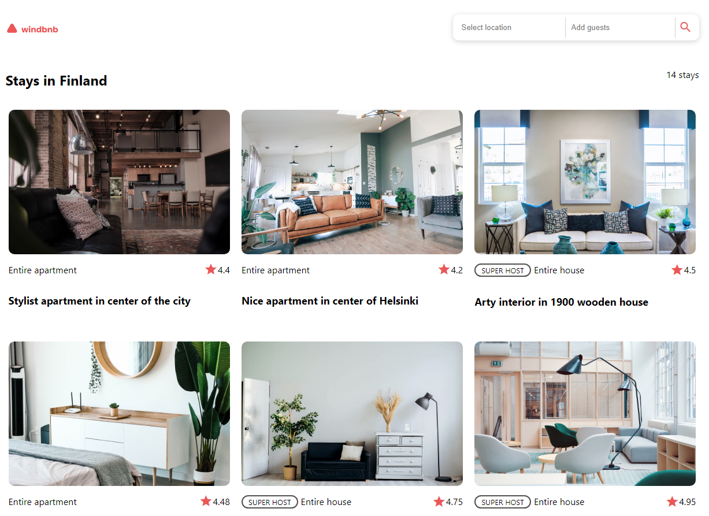

<!-- Please update value in the {}  -->

<h1 align="center">WindBnB</h1>

<div align="center">
   Solution for a challenge from  <a href="http://devchallenges.io" target="_blank">Devchallenges.io</a>.
</div>

<div align="center">
  <h3>
    <a href="https://cloudberries27.github.io/DevChallenge-Windbnb/">
      Demo
    </a>
    <span> | </span>
    <a href="https://github.com/cloudberries27/DevChallenge-Windbnb">
      Solution
    </a>
    <span> | </span>
    <a href="https://devchallenges.io/challenges/3JFYedSOZqAxYuOCNmYD">
      Challenge
    </a>
  </h3>
</div>

<!-- TABLE OF CONTENTS -->

## Table of Contents

- [Overview](#overview)
  - [Built With](#built-with)
- [Features](#features)
- [How to use](#how-to-use)
- [Contact](#contact)
- [Acknowledgements](#acknowledgements)

<!-- OVERVIEW -->

## Overview



- Demo is above ^^
- This took a hot minute lol more like a week or so to do. Mostly because I just couldn't find any time to finish it. 
- The whole filter/search dropdown area was annoying to do. Especially to make it responsive. I had to reorganize a few tags a few times. 
- wisdom? still ain't got any lmao 

### Built With

<!-- This section should list any major frameworks that you built your project using. Here are a few examples.-->

- [React](https://reactjs.org/)
- CSS

## Features

<!-- List the features of your application or follow the template. Don't share the figma file here :) -->

This application/site was created as a submission to a [DevChallenges](https://devchallenges.io/challenges) challenge. The [challenge](https://devchallenges.io/challenges/3JFYedSOZqAxYuOCNmYD) was to build an application to complete the given user stories.

## How To Use

<!-- Example: -->

To clone and run this application, you'll need [Git](https://git-scm.com) and [Node.js](https://nodejs.org/en/download/) (which comes with [npm](http://npmjs.com)) installed on your computer. From your command line:

```bash
# Clone this repository
$ git clone https://github.com/your-user-name/your-project-name

# Install dependencies
$ npm install

# Run the app
$ npm start
```

## Acknowledgements

<!-- This section should list any articles or add-ons/plugins that helps you to complete the project. This is optional but it will help you in the future. For exmpale -->

- [gh-pages](https://www.npmjs.com/package/gh-pages)
- [Material Icon](https://fonts.google.com/icons)

## Contact

- Website [fanamera.com](https://fanamera.com)
- GitHub [@cloudberries27](https://github.com/cloudberries27)
- Codepen [@cloudberries27](https://codepen.io/cloudberries27)
